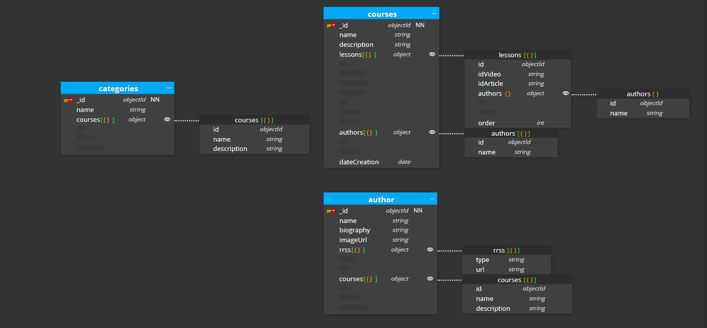

## Explicación del modelado

Este modelado me parece el más optimo para el sitio web al que va dirigido, en este caso, un portal de cursos con lecciones. Vamos a verlo paso a paso:

## Patrones aplicados

### Subset Pattern

He aplicado este patrón en esta tabla porque como bien dice el enunciado la página de autores no va a ser muy visitada por lo tanto, para no llenar el WorkSet de campos inecesarios, he optado por embeber en el campo lecciones el autor con los datos más importantes como son el id para identificarlo, como el nombre

### Extended ref

Como podemos ver en la tabla de autor y tematica he utilizado el patrón extended ref, la razón del porque lo he utilizado ha sido porque nosotros queremos que cuando se haga click en un autor aparte de su nombre, biografia, etc.. se carguen también rápido los cursos que tiene.

Y en tematica he hecho lo mismo, porque si en la pagina de incio queremos cargar los cursos por temática/categoría también tendremos que cargar rápido también los cursos que pertenecen a esa tematica en concreto
