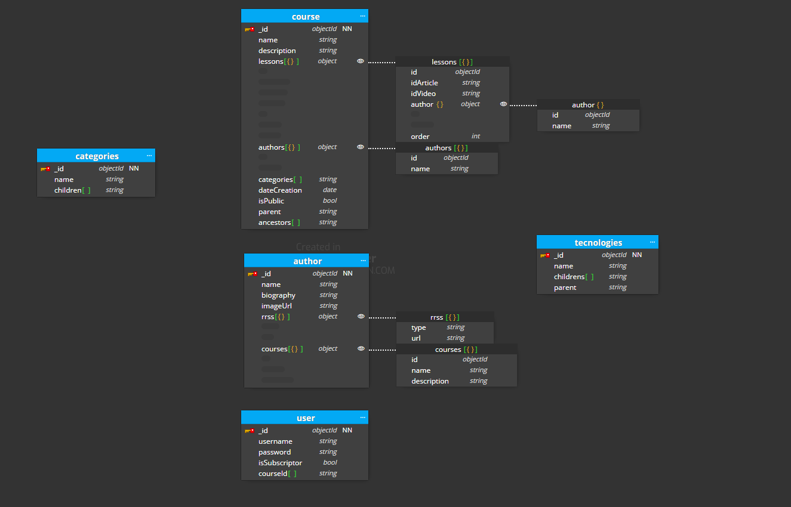

# Explicación del modelado

He creado este modelado porque es el que más se ajusta al enunciado y es optimo de cara a las consultas. Vamos a verlo paso a paso:

## Patrones que he aplicado

### Ancestor Array + Parent Reference

Aquí he utilizado este patrón porque aquí podría querer mostrar al usuario un path de en que categoria se encuentra y que tencnologia quiere aprender, este patrón combinado me ayuda a simplificar la consulta a la hora de mostrar ese path en la aplicación

### Child Reference

Aquí he utilizado este patrón porque a diferencia del anterior, aquí necesito solo a los hijos

### Array of ancestors + Parent Reference y Extended ref

En está tabla he utilizado el patrón combinado array of ancestors + Parent Reference porque queremos que cuando un usuario entre en una categoria se pinte un path en la parte superior indicandole donde se encuentra y con este patrón la consulta se nos hará mucho más sencilla.
Luego el patrón que también he utilizado ha sido el Extended ref porque queremos simplificar la consulta evitando tener que utilizar joins

### Subset Pattern Y Extended ref

Aqui he utilizado el patrón subset pattern porque como el autor no va a ser muy visitado y por ende no tendremos muchas peticiones nos llevamos toda su información a otra tabla. Dentro de la tabla de autor hemos embebido los cursos (Extended ref pattern) para que si algún usuario lo carga, los cursos carguen junto con toda la info del autor

Por último, he creado la tabla user en donde hay un tenemos un campo que se llama isSubscriptor que es boleano y en la aplicacion podriamos saber si un usuario esta suscrito o no con este campo, también he introducido un campo de tipo array con todos los ids de los cursos para poder mostrarle al usuario que cursos tiene
